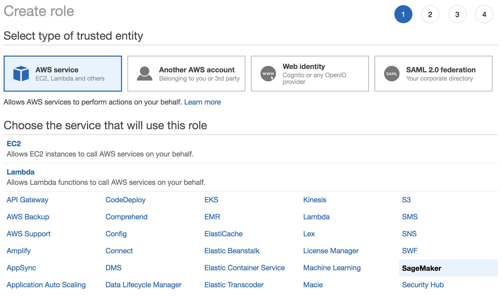
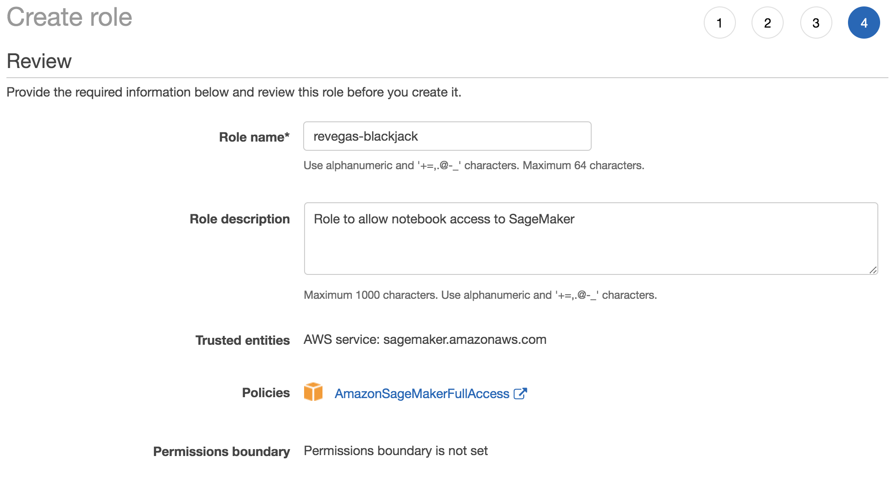
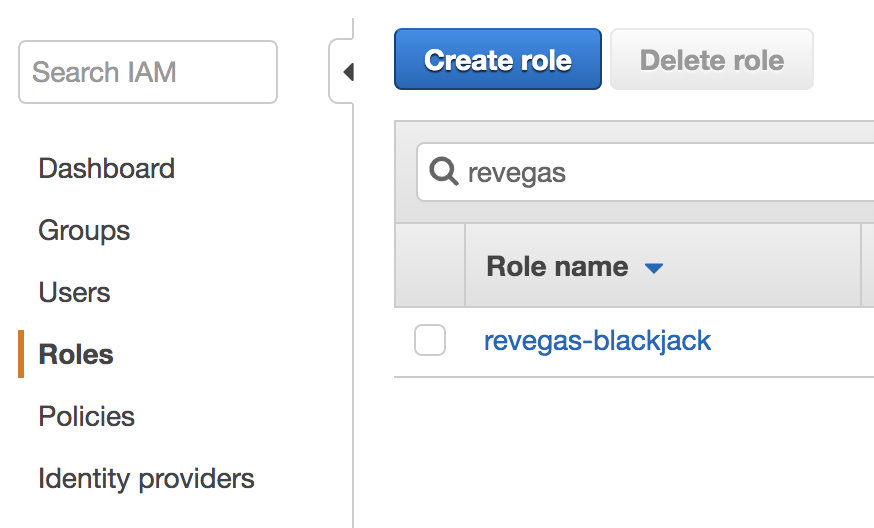
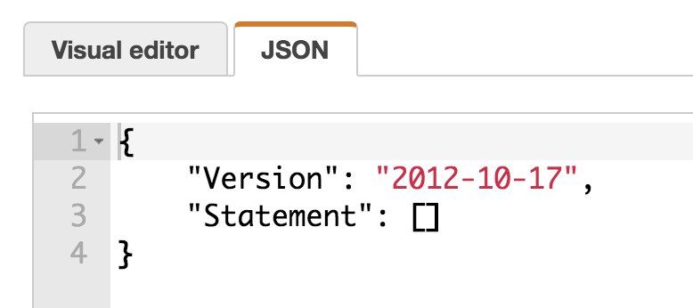
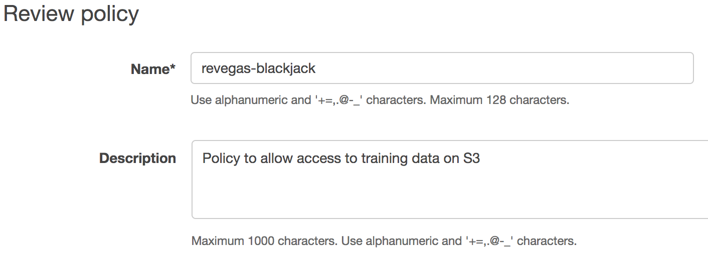
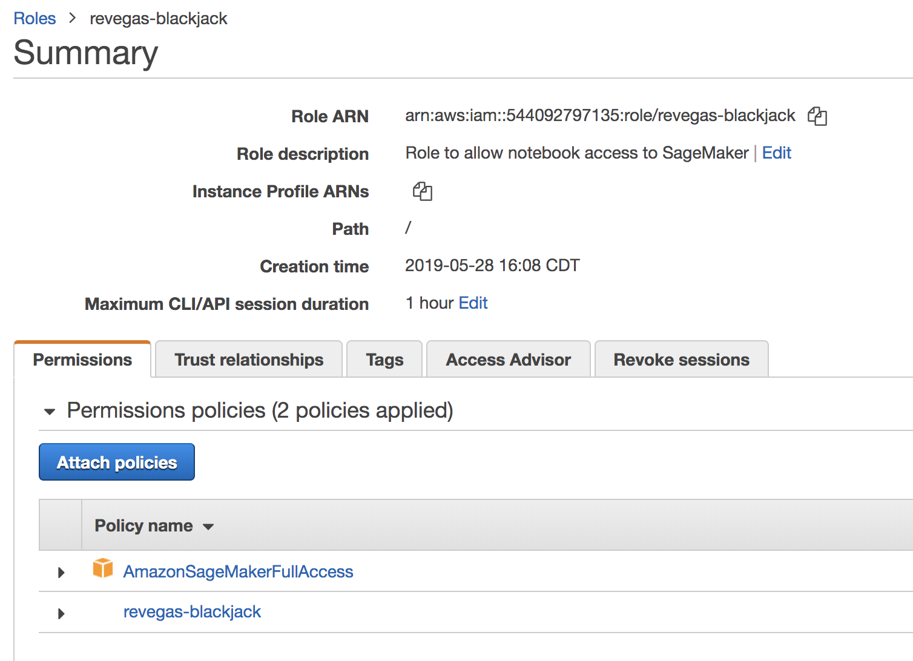
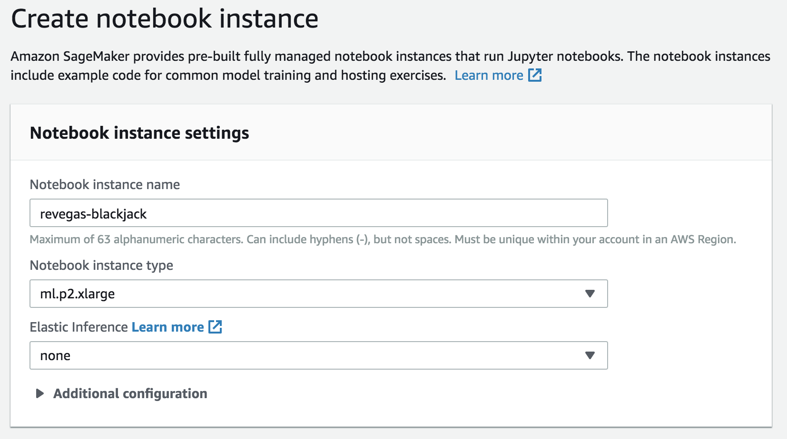
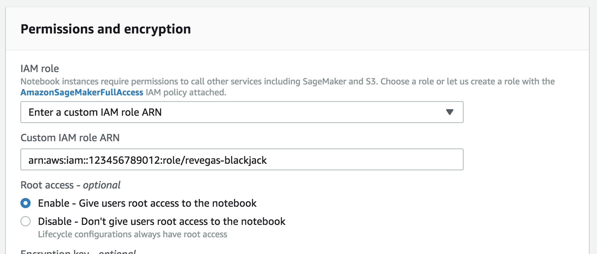
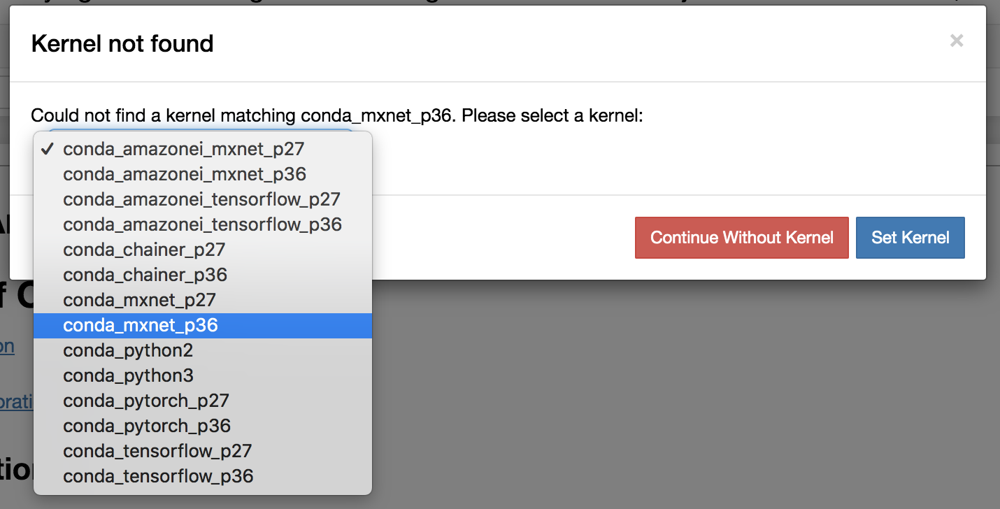

# Lab Guide: re:Vegas Blackjack 

# Using Amazon SageMaker Object Detection For Playing Cards

## Table of Contents

1. Introduction
2. Create a SageMaker role and policy
3. Setup your SageMaker notebook
4. Detecting playing cards using Amazon SageMaker's built-in object detection

### Important Note: At the end of this workshop, do not forget to shut down your resources. The ml.p2.xlarge instance is over $1/hr.

### Introduction

In this workshop, you will learn how to use machine learning and computer vision to detection the rank and suit of playing cards from a [Standard 52-card deck](https://en.wikipedia.org/wiki/Standard_52-card_deck). We'll use cloud services from AWS to develop, train, and deploy for prediction a deep neural network model in under an hour.

Object detection is the process of identifying and localizing objects in an image. A typical object detection solution takes an image as input and provides a bounding box on the image where an object of interest is found. It also identifies what type of object the box encapsulates. To create such a solution, we need to acquire and process a traning dataset, create and setup a training job for the alorithm so that it can learn about the dataset. Finally, we can then host the trained model in an endpoint, to which we can supply images.

We provide a training set of 5,000 images of playing cards in Amazon S3 that are synthetically displayed with different backgrounds, rotation, zoom, and other image augmentation techniques. This notebook is an end-to-end example showing how the Amazon SageMaker Object Detection algorithm can be used such playing card images to detect playing cards on a blackjack table. Amazon SageMaker's object detection algorithm uses the Single Shot multibox Detector [(SSD)](https://arxiv.org/abs/1512.02325) algorithm, and this notebook uses a [ResNet](https://arxiv.org/pdf/1603.05027.pdf) base network with that algorithm.

### Create a SageMaker role and policy

Amazon SageMaker is a fully-managed service that covers the entire machine learning workflow to label and prepare your data, choose an algorithm, train the model, tune and optimize it for deployment, make predictions, and take action. For this workshop, we'll use Notebooks in Amazon SageMaker to design, build, and train our model.

To use SageMaker, you'll need to use an existing account from Amazon Web Services (AWS), or create a new one at [https://aws.amazon.com/](https://aws.amazon.com/).

You'll also need a custom Identity and Access Management (IAM) role and policy to give your notebook access to SageMaker and Amazon S3. 

Once you've logged into the [AWS console](https://console.aws.amazon.com/), click the "Services" dropdown use the search box to find "IAM", 
or visit the IAM console directly at [https://console.aws.amazon.com/iam/home?region=us-east-1#/home](https://console.aws.amazon.com/iam/home?region=us-east-1#/home). 

Let's create a role first. On the left navigation menu, click "Roles," then click the **Create role** button to create a new role. Under "Choose the service that will use this role, select "SageMaker",

then, click the **Next: Permissions** button.

You'll notice an "AmazonSageMakerFullAccess" policy is given by default for this role. Finish the creation of this role with the default permissions by clicking **Next: Tags**, then **Next: Review**, and finally giving the role a name and optional description before clicking the **Create role** button.

Now that your role is created, let's add a policy to it, which will give our notebook access to the S3 bucket that contains our training data. 

Make sure you're on [IAM's Roles](https://console.aws.amazon.com/iam/home?region=us-east-1#/roles) page, then filter the roles by typing "revegas" into the search box. 

Click the ["revegas-blackjack" link](https://console.aws.amazon.com/iam/home?region=us-east-1#/roles/revegas-blackjack) to look load the role summary, then click the **Attach policies** button, then click the **Create policy** button. This will open a new tab.

Click the "JSON" tab as shown below, 

and enter the following JSON code:

    {
        "Version": "2012-10-17",
        "Statement": [
            {
                "Action": [
                    "s3:ListBucket"
                ],
                "Effect": "Allow",
                "Resource": [
                    "arn:aws:s3:::remars2019-revegas-trainingdata"
                ]
            },
            {
                "Action": [
                    "s3:*",
                    "s3:PutObject",
                    "s3:DeleteObject"
                ],
                "Effect": "Allow",
                "Resource": [
                    "arn:aws:s3:::remars2019-revegas-trainingdata/*"
                ]
            }
        ]
    }

Then, click the **Review policy** button.

Fill out the "Name" and "Description" fields of the policy similar to the screenshot below,

then click the **Create policy** button.

Go back to the tab containing your roles, and filter policies by the phrase "revegas". You will probably have to hit the refresh button near the upper-right to see your newly-created policy.

Tick the checkbox next to the policy, then click the **Attach policy** button. Verify that your role has two policies now:

* AmazonSageMakerFullAccess
* revegas-blackjack

**Note: Make sure to copy the "Role ARN", you'll need it for the next session**

### Setup your SageMaker notebook

Click the "Services" dropdown use the search box to find "SageMaker", or visit the SageMaker console directly at [https://console.aws.amazon.com/sagemaker/home?region=us-east-1#/](https://console.aws.amazon.com/sagemaker/home?region=us-east-1#/). 

In SageMaker's left navigation menu, click "Notebook Instances" under **Notebook**, then click the "Create notebook instance" button on the right side of the page, or use the link below.

Fill out the "Notebook instance settings" form as shown below. You can use any Notebook instance type you want, but for best results choose one of the accelerated computing instances, like the __ml.p2.xlarge__. 

Next, fill out the "Permissions and encryption" form as shown below. For the **IAM Role** setting, choose "Enter a custom IAM role ARN".

Scroll to the bototm of the form and click the **Create notebook instance**. It will take a few minutes to provision the instance that runs your notebook. Once it finishes provisioning, you'll see an "InService" status. Click the [Open Jupyter link](https://console.aws.amazon.com/sagemaker/home?region=us-east-1#/notebook-instances/openNotebook/revegas-blackjack?view=classic) link to open your notebook.

Now it's time to upload a pre-built notebook to Jupyter. First, [download and save the notebook](https://s3.amazonaws.com/remars2019-revegas-trainingdata/Detecting+Playing+Cards+Using+Amazon+SageMaker+Built-In+Object+Detection.ipynb), then click the "Upload" button and locate the file you just downloaded. Click the "Upload" button to complete the process, then click on the notebook to open it.

You will likely see an error message, "Kernel not found." Use the dropdown box to select the `conda_mxnet_p36` kernel, then click the **Set Kernel** button.

### Detecting playing cards using Amazon SageMaker's built-in object detection

#### Congratulations!

You have now setup a SageMaker notebook instance from which you can train a neural network to detect objects. Follow each step in the notebook to continue the lab.

# Important Note: At the end of this workshop, do not forget to shut down your resources. The ml.p2.xlarge instance is over $1/hr.

